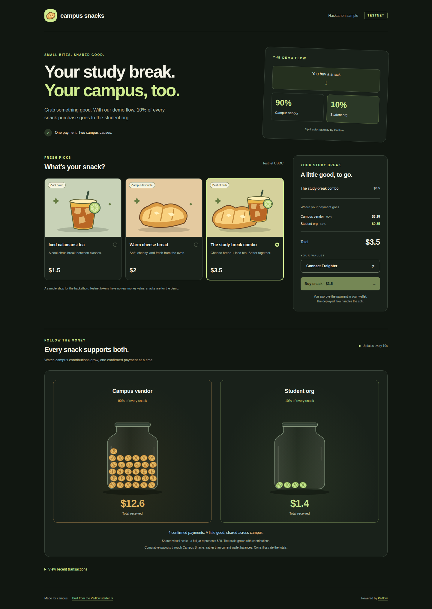

# Campus Snacks

A small hackathon sample built **from the [Paiflow starter template](https://github.com/artisam-paiflow/paiflow-hackathon-starter)**, using the same setup and integration path as participants.

Pick one of three snacks, connect Freighter, and pay testnet USDC. The sample represents one branch of a snack shop. One Paiflow deployment serves all customers of that branch and routes **90% to the campus vendor and 10% to the student organisation**. The app shows a split preview, a confirmed-payment receipt, and two live coin jars showing cumulative contributions to the vendor and student organisation.

Live demo: [campus-snacks.up.railway.app](https://campus-snacks.up.railway.app). Prices and jar totals use `$` for testnet USDC.

This is a sample shop: no real snacks, real-money prices, fulfilment, or persistent order database. Nothing is marked paid until Paiflow returns `SUCCESS`. `PENDING` and uncertain submissions keep the signed transaction for **Check again**.



The unconfigured sample lets you browse the menu; payments unlock after setup.

## Choose the right resource

| Resource | Use it for |
| --- | --- |
| [Developer guide](https://github.com/webnxt-2030/pinkraft/blob/hackathon-staging/docs/hackathon/developer-guide.md) | Wallet setup, building and deploying a flow, and configuring the ready-wired starter. |
| [API quickstart](https://github.com/webnxt-2030/pinkraft/blob/hackathon-staging/docs/hackathon/developer-api-quickstart.md) | A separate frontend/backend integration for apps built without the starter. Do not copy its routes into this repository. |
| [Full API reference](https://github.com/webnxt-2030/pinkraft/blob/hackathon-staging/docs/api/README.md) | Endpoint schemas, errors, limits, pagination and advanced workflows. |
| [AI developer context](llms.md) | Product constraints, API details and worked examples for your AI assistant. |

The human guides and their PDFs live directly in `docs/hackathon/` in the Paiflow repository. They are event-neutral; follow your participant brief for event rules.

## Hackathon timeline

Follow your event's participant brief and organisers for onboarding, preparation permissions, credentials, integration timing and submission rules. This repository does not set those rules.

Use preparation mode to build and customise non-payment screens. Prepare dedicated customer and recipient testnet wallets and obtain funding when your event permits it; wallet support or fallback wallets depend on the organisers.

Organiser-provided fallback wallets are testnet-only; organisers retain copies of their keys. Never use them for real funds or import their keys into a wallet you use for real money. Never put wallet secret keys in the app.

## Run locally

Requires **Node 22** and **pnpm 10**. No additional dependencies were added to the starter.

```bash
git clone https://github.com/artisam-paiflow/paiflow-campus-snacks.git
cd paiflow-campus-snacks
corepack enable
pnpm install --frozen-lockfile
cp .env.example .env.local
pnpm dev
```

Open http://localhost:3000. The app defaults to preparation mode, including when credentials are present. Wallet actions, payments and event polling stay disabled until you explicitly select team mode and configure the stand below. Direct payment/event requests return HTTP 403 `PREPARATION_MODE`; the server makes no upstream calls. This sample deliberately does not use the starter's shared XLM swap demo, which would send funds through a different flow.

## Set up the stand in Paiflow

1. Sign into [Paiflow testnet](https://beta.app.paiflow.xyz) with your team account.
2. Build **On Receive (USDC) → Split (USDC)**, with percentage recipients in this order:

   | Recipient                           | Share | Basis points |
   | ----------------------------------- | ----- | ------------ |
   | Campus vendor testnet wallet        | 90%   | 9000         |
   | Student organisation testnet wallet | 10%   | 1000         |

   Use two distinct, funded testnet public `G…` addresses. Replace the builder's default recipients. Leave Dev mode off; do not use fixed Split amounts or a Swap. Leave the receive minimum unset.

3. Confirm both recipients have a trustline for the exact testnet USDC asset: code `USDC`, issuer `GBBD47IF6LWK7P7MDEVSCWR7DPUWV3NY3DTQEVFL4NAT4AQH3ZLLFLA5`. A fresh account needs testnet XLM for reserves and fees before it can add the trustline. A trustline to another USDC issuer will not work.
4. Connect the deploying wallet, sign deployment, and wait for **CONFIRMED**. Create its token under **API access**.
5. Set these values in `.env.local` (or your app host's server environment), then restart:

   ```dotenv
   PAIFLOW_MODE=team
   PAIFLOW_BASE_URL=https://beta.app.paiflow.xyz
   PAIFLOW_API_TOKEN=<your deployment API token>
   PAIFLOW_DEPLOYMENT_ID=<your confirmed deployment UUID>
   ```

   Set team mode only when your event permits integration. Missing or invalid credentials disable integration with a clear configuration error; `demo` is unsupported and never selected by an empty token. Keep the guards when customising the app. Confirm any pending signed payment before changing modes.

   Keep the token on the server. Never use `NEXT_PUBLIC_`, commit `.env.local`, or paste wallet secrets into the app. One deployment serves all this stand's customers.

6. Install [Freighter](https://www.freighter.app/), select **Testnet**, and connect a funded customer wallet with the same USDC trustline and a testnet USDC balance. Adding a trustline does not provide a balance. Check the exact trustline and required balances in every wallet, including any organiser-provided fallback wallet. Friendbot supplies XLM, not USDC.

**Testnet USDC funding:** after funding the wallet with XLM and adding the exact USDC trustline, open [Circle's testnet faucet](https://faucet.circle.com/), select **USDC** and **Stellar Testnet**, and enter the customer's public wallet address (`G…`). Confirm the USDC balance before testing payments. Repeat for any wallet that will fund a flow, and choose test amounts that fit the available balance. Friendbot supplies XLM, not USDC.

The app's 90/10 display is a preview of this required flow setup. The sample cannot inspect your graph through the starter API: configuring a different deployment changes where money actually goes. Review the deployed recipients and shares, then rehearse the payout. API simulation checks account and trustline readiness before signing.

## Rehearse the demo

1. Choose **The study-break combo**: total 3.5 USDC; vendor preview 3.15; student org preview 0.35.
2. Connect the customer wallet and choose **Buy snack**. Approve the transaction in Freighter.
3. Wait for **Payment confirmed**, then follow **View transaction**. Confirm the vendor and student organisation payouts using the deployment's contract addresses and the on-chain transaction.
4. Watch the **Campus Vendor** and **Student Org** coin jars fill after matching payment and payout events arrive. Each jar shows cumulative USDC received through this deployment, rather than its wallet balance. Both use a shared visual scale that expands as contributions grow; coins illustrate the totals. Expand **View recent transactions** for explorer links. The feed can lag; absence of an event is not proof that a transaction failed.
5. To demonstrate a second customer, switch accounts in Freighter and select **Refresh wallet**.

The percentage Split event contains configured shares, not transferred amounts. Jar totals pair one USDC deposit with one 90/10 Split payout in the same transaction and follow contract rounding (the last recipient receives the remainder). Events are deduplicated by `eventId`. Initial history fills the jars without replaying animations; only newly matched payouts trigger coin drops. Unmatched or unsupported activity stays visible in the transaction history and is excluded from the totals. Reduced-motion preferences disable the drops.

If signing takes too long, the preparation may expire (use its `expiresAt`; normally about three minutes). If nothing was submitted, prepare and sign again. Once submitted, check its outcome before preparing another payment, even if the preparation has expired.

If confirmation is pending or the server/network returns an uncertain error, keep the tab open and select **Check again**. It resubmits the exact signed envelope; do not prepare a second payment. The sample holds pending envelopes only in tab memory. On a reload, check the wallet/explorer before starting a new order. Cancelled signing creates no receipt; HTTP 200 with `FAILED` is still a failed payment.

A real end-to-end wallet/payout rehearsal is still required after configuring the deployment. Automated tests use mocked Paiflow responses and do not establish that a live deployment is funded or ready.

## What changed from the template

- `app/page.tsx`: resolves only non-secret setup state on the server.
- `components/snack-stand.tsx`: menu, checkout, receipt, and expandable cursor-based transaction history; no bearer token in browser calls.
- `components/contribution-jars.tsx` and `lib/jar-totals.ts`: animated coin jars and exact contributions from matched payment/payout events.
- `public/snack-logo.svg`: shared cheese-bread header logo and tab icon, configured in `app/layout.tsx`.
- `lib/menu.ts`: three menu items, exact stroop prices and split arithmetic using bigint. Edit this to change the menu.
- `lib/checkout.ts` and `app/api/pay/route.ts`: accept `{ from, itemId }`; calculate the price on the server. Reject client-supplied prices, recipient overrides and unknown fields. Signed submission still uses `{ signedXdr }`.
- `lib/paiflow.ts`, `lib/wallet.ts`, and `lib/amount.ts`: retain the starter's integration, mainnet refusal, and amount helpers. Paiflow calls stay in the server-only typed client; Freighter signs in the browser.
- Removed the starter's public `/api/payout` proxy. The stand uses fixed contract recipients and exposes no early-release route.

This is checkout plumbing for a hackathon, with no auth, stock or fulfilment system. The selected snack is not stored in the contract or a persistent order record. Server-calculated preparation prices do not make the UI receipt an authorisation to deliver real goods. Add verified order-to-transaction binding and your own app authorisation before extending it into a real store.

Read [llms.md](llms.md) for the participant API context and [the Paiflow OpenAPI document](https://beta.app.paiflow.xyz/api/v1/openapi.json) for endpoint details.

## Checks

```bash
pnpm typecheck
pnpm build
pnpm test
pnpm check:bundles
pnpm audit
```

Tests cover the inherited API and wallet behaviour, exact menu totals, invalid input, price tampering, missing configuration, pending/failed outcomes and exact-envelope retry. CI runs these checks and builds with a dummy credential marker; `check:bundles` verifies server credential markers are absent from browser assets. Before publishing with real configuration, also check the browser bundles for your actual token without printing it.
